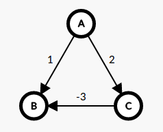
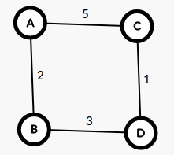
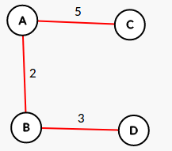
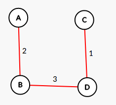

# Answers

## ** 1 Dijkstra May Not Work If Some Edge Weights Are Negative **

Here is the my counter example graph that I draw at a website[1].

When we run Dijkstra on this graph from node A. Initially we add A to S with 0 cost. In first iteration we find A->B costs 1 and A->C costs 2. Thus, we add B to S with cost 1. On second iteration we find A->C costs 2 and there is not any other available edge. So we add C to S with cost of 2. Since, we reachead all the nodes algorithm terminates.

But did it really found the shortest path to all nodes? Clearly not. We found that A->B is costs 1. However, there is a path A->C->B which gives us a better cost -1. Thus, this counter example shows if there are negative weight edges Dijkstra algorithm might not work properly.

## ** 2 Shortest Path vs. MST  **

a) For the purpose of contradiction, assume union of all these n-1 paths forms a tree T. Let an edge e is not in the T and is a part of a shortest path to node v from s. If we add e to T, new graph will contain a cycle in between s and v nodes. Since e creates a new shortest path to v, from Cycle Property we can remove another edge e' in this cycle which gives us a tree. Since new path is a shortest path, it should have been found on the initial tree. Contradiction!! Thus there cannot  be such an edge e.

b) I can prove it with a counter example:

Shortest(Dijkstra) path algorithm finds:

MST finds:

## ** 3 Counting Argument  **

. We will use following two property of simple cycles.
A simple cycle:
* is a subset of the graph which contains a node at most once.
* must be at least size 3 and at most size n.

Assume the graph is complete graph. There can be 2^n different subset of n node graph G.

To find simple cycle subsets we have to subtract the subsets which have only 0,1 or 2 nodes.

Result is
= 2^n - (n | 2) - (n | 1) - (n | 0)
= 2^n - (n^2 - n)/2 - n - 1
= 2^n - (n^2 + n + 2)/2

## ** 4 Either This or That  **
We know that when a graph has distinct positive weights then MST is unique.

We want to prove a randomly selected e is either A or B.
* A: Smallest weighted edge of some cut of G
* B: Largest weighted edge of some cylce in G.

From;
* Cut Property; we know that for every e in G if e is A, then e is in the MST.
* Cycle Property; we know that for every e in G if e is B, then e is not in the MST.

Conclusion, a randomly selected edge can be either in the MST or not. Similarly, it can either satisfies Cut Property or Cycle Property. There cannot be any other option for any edge in G.

## ** 5 Deciding Whether an Edge is Part of MST or not in Linear Time  **

Probably, I could not come up with this answer, if instructor did not mention it in the class. Thankfully he did.

To solve this, we will use Cycle Property.

For a given edge e of G;

- Remove all edges which has bigger cost than edge e. Now we have the graph H with maximum cost edge as e. O(m)
- Remove edge e(u,v) from the graph H. Now we have graph H'.
- Run BFS from u on H'. O(m+n)
- If BFS reaches v then, this means on graph H there is a cycle between nodes v and u. Since e is the maximum cost edge of the graph and its in this cycle then it cannot be in the MST. If BFS cannot reach v then e is in the MST.

In total this algorithm takes O(m+n) time.

## ** 6 Your Military Service  **

Let;
pi = pool time of soldier i
ri = running time of soldier i
bi = biking time of soldier i
rbi = ri + bi time of soldier i

Proposed Schedule: Send soldiers to pool in a descending order of their rbi.

Our Answer Solution would be: A < s1,s2,s3 ... sn > for n soldiers and for all i < i+1, rbi > rb(i+1).
Let there be a better solution with : O < s1,s2,s3 ... sn > for n soldiers.

In our solution there is a pair si and sj, where rbi>rbj.
In optimal solution let these two be swapped in entering order.

Total time in our solution would be: t0 + pi + max( rbi, pj+rbj)
Total time in optimal solution would be: t0 + pj + max( rbj, pi+rbi) since rbi>rbj this is always t0 + pj + pi + rbi.

Compare both solutions remove common t0's and pi's. Then we left with A=max(rbi, pj+rbj) vs O=(pj + rbi) where A is always smaller than O, thus our solution is better then propesed optimal solution. Hence it is optimal solution.

## ** 7 Minimizing Makespan **

Algorithm:
* Create an minheap of size n for n machines.
* Calculate initial lj(1) values for every machine j and put into jth index of array.
* For every job i
  * Take the minimum valued machine from heap, remove from heap.
  * Assign job i to selected machine s.
  * Add the machine s latency with next latency value of ls(next) to the heap.

Main loop does m iteration and heapify takes logn time. In total it results in mlogn.

[1] https://csacademy.com/app/graph_editor/
